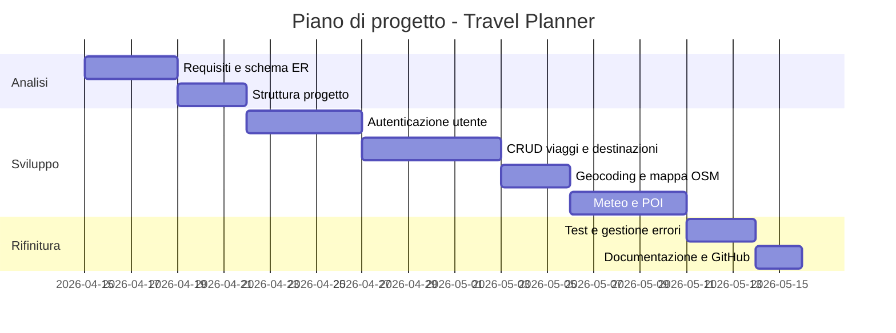

# TravelPlanner-Progetto-Finale

## 1. Introduzione

### 1.1 Scopo del documento

Lo scopo di questo documento è:

- descrivere in modo chiaro il prodotto da realizzare;
- raccogliere i requisiti funzionali e non funzionali;
- fornire una progettazione concettuale con schema ER e casi d'uso;
- definire una roadmap di sviluppo con milestone e attività principali.

### 1.2 Contesto

Il progetto è sviluppato nell'ambito del quinto anno di informatica e prevede la realizzazione di un'applicazione web con backend Python/Flask e database relazionale SQLite3. Il progetto include un sistema di autenticazione, un CRUD completo e l'integrazione con servizi esterni tramite API pubbliche gratuite, senza JavaScript lato client.

### 1.3 Tema d'esempio

Tema scelto: **Travel Planner**.

Travel Planner è un'applicazione web per la pianificazione di viaggi personali. L'utente può creare e gestire i propri viaggi, aggiungere destinazioni georeferenziate, consultare le previsioni meteo e ricercare punti di interesse nelle zone di destinazione.

Le API utilizzate sono tutte gratuite e non richiedono registrazione a pagamento:

| API | Funzione | Key richiesta |
|---|---|---|
| Nominatim | Geocoding (nome città → coordinate) | No |
| Leaflet + OSM | Link mappa interattiva | No |
| Open-Meteo | Previsioni meteo fino a 7 giorni | No |
| Overpass API | Ricerca POI (musei, ristoranti, attrazioni) | No |

---

## 2. Obiettivi generali

1. Permettere a un utente di registrarsi e autenticarsi in modo sicuro.
2. Consentire la creazione, modifica, eliminazione e visualizzazione dei viaggi (CRUD).
3. Permettere di aggiungere destinazioni a un viaggio con coordinate geografiche.
4. Mostrare le previsioni meteo per le destinazioni nel periodo del viaggio.
5. Permettere la ricerca di punti di interesse (POI) nelle destinazioni tramite Overpass API.
6. Mantenere tutta la logica lato server, senza JavaScript nel browser.

---

## 3. Stakeholder e attori

| Stakeholder | Ruolo | Interesse |
|---|---|---|
| Studente | Sviluppatore | Realizzare il progetto rispettando i requisiti |
| Docente | Valutatore | Verificare correttezza tecnica e completezza |
| Utente finale | Viaggiatore | Usare l'app per pianificare e gestire i propri viaggi |

### Attori principali

- `Utente autenticato` — può creare e gestire i propri viaggi e destinazioni, consultare meteo e POI.
- `Visitatore` — può accedere solo alle pagine di login e registrazione.

---

## 4. Requisiti funzionali

### 4.1 Requisiti principali

1. Registrazione con nome, email e password (hashing con `werkzeug.security`).
2. Login con verifica credenziali e gestione della sessione Flask.
3. Protezione delle route con decoratore `login_required`.
4. Creazione di un nuovo viaggio con titolo, date di inizio/fine e note.
5. Visualizzazione dell'elenco dei propri viaggi.
6. Modifica ed eliminazione di un viaggio.
7. Ricerca di una destinazione tramite Nominatim (geocoding server-side).
8. Aggiunta e rimozione di destinazioni da un viaggio, con coordinate salvate nel DB.
9. Link diretto a OpenStreetMap per visualizzare ogni destinazione.
10. Previsioni meteo a 7 giorni per una città tramite Open-Meteo.
11. Ricerca di punti di interesse per tipo e raggio tramite Overpass API.

### 4.2 User stories

- Come **utente**, voglio registrarmi e accedere affinché i miei viaggi siano salvati sotto il mio account.
- Come **utente autenticato**, voglio creare un viaggio con titolo e date per organizzare la mia pianificazione.
- Come **utente autenticato**, voglio cercare una città e aggiungerla come destinazione a un viaggio.
- Come **utente**, voglio vedere le previsioni meteo per una città in modo da preparare i bagagli.
- Come **utente**, voglio cercare ristoranti e attrazioni nella mia destinazione per pianificare le attività.
- Come **utente**, voglio poter modificare o eliminare un viaggio se cambio i piani.

---

## 5. Requisiti non funzionali

- L'applicazione deve essere eseguibile localmente tramite un ambiente virtuale Python.
- Le password devono essere salvate come hash (`werkzeug.security`) e mai in chiaro nel database.
- Le configurazioni sensibili devono essere gestite tramite file `.env`, escluso da git.
- Il codice deve essere organizzato con Blueprint e Repository pattern.
- I dati devono essere persistenti tra una sessione e l'altra tramite SQLite3.
- Le chiamate alle API esterne avvengono interamente lato server (nessun JS nel browser).
- L'interfaccia deve essere semplice e navigabile senza framework CSS esterni.
- Le dipendenze devono essere minime: `flask`, `requests`, `python-dotenv`.

---

## 6. Casi d'uso

### 6.1 Casi d'uso essenziali

1. Registrazione utente
2. Login
3. Logout
4. Creazione viaggio
5. Modifica viaggio
6. Eliminazione viaggio
7. Ricerca e aggiunta destinazione
8. Rimozione destinazione
9. Ricerca previsioni meteo
10. Ricerca punti di interesse (POI)

### 6.2 Descrizione semplificata dei casi d'uso

- **Registrazione**: il visitatore inserisce nome, email e password; il sistema verifica che l'email non sia già registrata, crea l'account con password hashata e reindirizza al login.
- **Login**: l'utente inserisce email e password; Flask verifica le credenziali e apre una sessione in caso di successo, altrimenti mostra un messaggio di errore.
- **Logout**: l'utente clicca su "Esci"; Flask cancella la sessione e reindirizza al login.
- **Crea viaggio**: l'utente compila un form con titolo, date e note; il sistema salva il viaggio nel database e reindirizza all'elenco.
- **Modifica viaggio**: l'utente modifica i campi di un viaggio esistente; il sistema aggiorna il record nel database.
- **Elimina viaggio**: l'utente conferma l'eliminazione; il sistema cancella il viaggio e tutte le destinazioni associate.
- **Aggiungi destinazione**: l'utente cerca una città (step 1: Flask chiama Nominatim); seleziona il risultato (step 2: Flask salva nome e coordinate nel DB).
- **Consulta meteo**: l'utente inserisce una città nella pagina Esplora; Flask chiama Open-Meteo e mostra le previsioni a 7 giorni in tabella.
- **Cerca POI**: l'utente sceglie tipo e raggio; Flask chiama Overpass API e mostra i risultati in lista con link a OpenStreetMap.

### 6.3 Relazioni tra casi d'uso: include ed extend

Le relazioni `<<include>>` indicano comportamenti sempre necessari; le relazioni `<<extend>>` indicano comportamenti opzionali che si attivano solo in certe condizioni.

| Caso d'uso base | Tipo | Caso d'uso collegato | Descrizione |
|---|---|---|---|
| Creazione viaggio | `<<include>>` | Login | L'utente deve essere autenticato |
| Modifica viaggio | `<<include>>` | Login | L'utente deve essere autenticato |
| Eliminazione viaggio | `<<include>>` | Login | L'utente deve essere autenticato |
| Aggiungi destinazione | `<<include>>` | Login | L'utente deve essere autenticato |
| Aggiungi destinazione | `<<include>>` | Geocoding Nominatim | La ricerca richiede sempre la chiamata a Nominatim |
| Consulta meteo | `<<include>>` | Login | L'utente deve essere autenticato |
| Consulta meteo | `<<include>>` | Geocoding Nominatim | Il meteo richiede sempre le coordinate della città |
| Cerca POI | `<<include>>` | Login | L'utente deve essere autenticato |
| Cerca POI | `<<extend>>` | Consulta meteo | L'utente può cercare anche il meteo nella stessa pagina |
| Eliminazione viaggio | `<<extend>>` | Eliminazione destinazioni | Le destinazioni vengono eliminate insieme al viaggio |

### 6.4 Diagramma dei casi d'uso

```
+----------------------------------------------------------+
|                     Travel Planner                       |
|                                                          |
|   [Registrazione]          [Login]                       |
|                                <<include>>               |
|   [Crea viaggio] -----------> [Verifica sessione]        |
|   [Modifica viaggio] -------> [Verifica sessione]        |
|   [Elimina viaggio] --------> [Verifica sessione]        |
|         |                                                |
|         +--<<extend>>--> [Elimina destinazioni]          |
|                                                          |
|   [Aggiungi destinazione] --> [Verifica sessione]        |
|         |                                                |
|         +--<<include>>-> [Geocoding Nominatim]           |
|                                                          |
|   [Consulta meteo] --------> [Verifica sessione]         |
|         |                                                |
|         +--<<include>>-> [Geocoding Nominatim]           |
|         +--<<include>>-> [Open-Meteo]                    |
|                                                          |
|   [Cerca POI] -------------> [Verifica sessione]         |
|         |                                                |
|         +--<<include>>-> [Overpass API]                  |
|                                                          |
+----------------------------------------------------------+
       ^                    ^
       |                    |
  [Visitatore]      [Utente autenticato]
```

---

## 7. Glossario dei termini

| Termine | Definizione |
|---|---|
| Viaggio | Un piano di viaggio creato da un utente, con titolo, date e note. |
| Destinazione | Una città o luogo associato a un viaggio, con coordinate lat/lng salvate nel DB. |
| POI | Point of Interest: ristorante, museo o attrazione ricercato tramite Overpass API. |
| Geocoding | Conversione del nome di una città in coordinate geografiche tramite Nominatim. |
| Utente | Account registrato che può gestire i propri viaggi. |
| Sessione | Stato di autenticazione mantenuto da Flask tra una richiesta e l'altra. |
| Repository | Classe Python che gestisce l'accesso al database per una specifica entità. |
| Blueprint | Modulo Flask che raggruppa route correlate (auth, trips, explore, api). |
| Hash | Trasformazione irreversibile della password prima del salvataggio nel database. |
| `.env` | File di configurazione locale con variabili sensibili, escluso dal repository git. |

---

## 8. Pianificazione e milestone

| Settimana | Attività |
|---|---|
| 1 | Analisi requisiti, schema ER, struttura progetto, configurazione ambiente virtuale |
| 2 | Sistema di autenticazione (registrazione, login, logout, sessione, `login_required`) |
| 3 | CRUD viaggi e destinazioni, geocoding server-side tramite Nominatim |
| 4 | Integrazione Open-Meteo e Overpass API, pagina Esplora completa |
| 5 | Testing, gestione errori (404, 500), documentazione, push su GitHub |

### 8.1 Gantt semplificato

