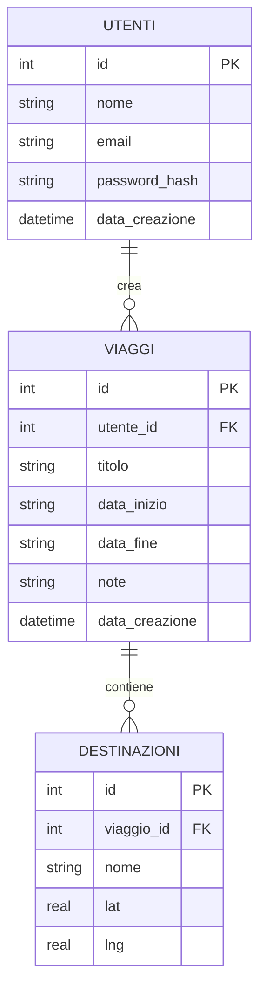
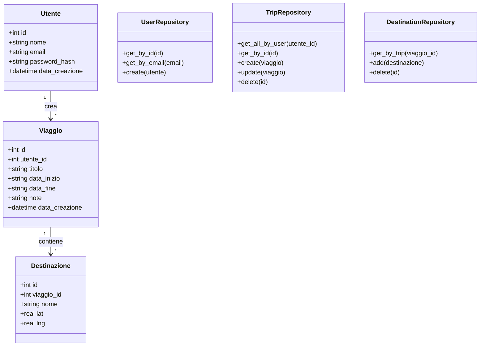
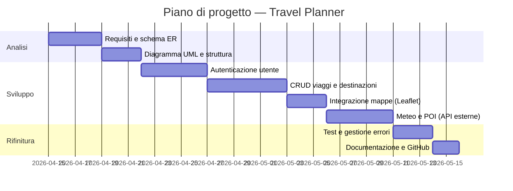

# Documento dei Requisiti — Travel Planner
## 1. Introduzione
### 1.1 Contesto

Il progetto è sviluppato nell'ambito del quinto anno di informatica e prevede la realizzazione di un'applicazione web con backend Python/Flask e database relazionale SQLite3. Il progetto deve includere un sistema di autenticazione, un CRUD completo e l'integrazione con servizi esterni tramite API pubbliche gratuite.

### 1.2 Descrizione del prodotto

Il prodotto scelto è **Travel Planner**, un'applicazione web per la pianificazione di viaggi personali. L'utente può creare e gestire i propri viaggi, aggiungere destinazioni con visualizzazione su mappa interattiva, consultare le previsioni meteo per ogni città e ricercare punti di interesse nelle zone di destinazione.

Le API utilizzate sono tutte gratuite e non richiedono registrazione a pagamento:

| API | Funzione | Key richiesta | Fonte |
|---|---|---|---|
| Nominatim | Geocoding (nome città → coordinate) | No | OpenStreetMap |
| Leaflet + OSM | Mappa interattiva nel browser | No | OpenStreetMap |
| Open-Meteo | Previsioni meteo fino a 7 giorni | No | Meteorologica |
| Overpass API | Ricerca POI (musei, ristoranti…) | No | OpenStreetMap |

---

## 2. Obiettivi generali

1. Permettere a un utente di registrarsi e autenticarsi in modo sicuro.
2. Consentire la creazione, modifica, eliminazione e visualizzazione dei viaggi (CRUD).
3. Permettere di aggiungere destinazioni a un viaggio con posizionamento su mappa.
4. Mostrare le previsioni meteo per le destinazioni nel periodo del viaggio.
5. Permettere la ricerca di punti di interesse (POI) nelle destinazioni tramite Overpass API.

---
## 4. Requisiti funzionali

### 4.1 Requisiti principali

1. Registrazione con nome, email e password (hashing con `werkzeug.security`).
2. Login con verifica credenziali e gestione della sessione Flask.
3. Creazione di un nuovo viaggio con titolo, date di inizio/fine e note.
4. Visualizzazione dell'elenco dei propri viaggi.
5. Modifica ed eliminazione di un viaggio.
6. Aggiunta e rimozione di destinazioni da un viaggio.
7. Visualizzazione delle destinazioni su mappa Leaflet (OpenStreetMap).
8. Previsioni meteo per una destinazione tramite Open-Meteo.
9. Ricerca di punti di interesse tramite Overpass API.

### 4.2 User stories

- Come **utente**, voglio registrarmi e accedere affinché i miei viaggi siano salvati sotto il mio account.
- Come **utente autenticato**, voglio creare un viaggio con titolo e date per organizzare la mia pianificazione.
- Come **utente autenticato**, voglio aggiungere destinazioni a un viaggio e vederle su una mappa.
- Come **utente**, voglio vedere le previsioni meteo per una città in modo da preparare i bagagli.
- Come **utente**, voglio cercare ristoranti e attrazioni nella mia destinazione.

---

## 5. Requisiti non funzionali

- L'applicazione deve essere eseguibile localmente tramite un ambiente virtuale Python.
- Le password devono essere salvate come hash (`werkzeug.security`) e mai in chiaro.
- Le chiavi di configurazione devono essere gestite tramite file `.env`, escluso da git.
- Il codice deve essere organizzato con Blueprint e Repository pattern.
- I dati devono essere persistenti tra una sessione e l'altra tramite SQLite3.
- Le chiamate alle API esterne devono essere proxate dal backend Flask, non esposte al browser.
- L'interfaccia deve essere semplice e navigabile senza framework CSS esterni.

---

## 6. Glossario dei termini

| Termine | Definizione |
|---|---|
| Viaggio | Un piano di viaggio creato da un utente, con titolo, date e note. |
| Destinazione | Una città o luogo associato a un viaggio, con coordinate geografiche. |
| POI | Point of Interest: ristorante, museo o attrazione ricercato tramite Overpass. |
| Geocoding | Conversione del nome di una città in coordinate lat/lng tramite Nominatim. |
| Utente | Account registrato che può gestire i propri viaggi. |
| Sessione | Stato di autenticazione mantenuto da Flask tra una richiesta e l'altra. |
| Repository | Classe Python che gestisce l'accesso al database per una specifica entità. |
| Blueprint | Modulo Flask che raggruppa route correlate (auth, trips, explore, api). |

---

## 7. Entità e relazioni (schema ER)

Le entità principali del database sono tre: utenti, viaggi e destinazioni.



### Relazioni

- Un utente può avere zero o più viaggi (1 a molti).
- Un viaggio può avere zero o più destinazioni (1 a molti).
- Una destinazione appartiene a esattamente un viaggio.

---

## 8. Diagramma UML delle classi



---

## 9. Casi d'uso

### 9.1 Elenco casi d'uso

1. Registrazione utente
2. Login
3. Creazione viaggio
4. Modifica viaggio
5. Eliminazione viaggio
6. Aggiunta destinazione a un viaggio
7. Rimozione destinazione
8. Visualizzazione mappa con destinazioni
9. Ricerca previsioni meteo
10. Ricerca punti di interesse (POI)

### 9.2 Descrizione sintetica

- **Registrazione**: il visitatore inserisce nome, email e password; il sistema crea un account con password hashata e reindirizza al login.
- **Login**: l'utente inserisce email e password; Flask apre una sessione in caso di successo.
- **Crea viaggio**: l'utente compila un form con titolo, date e note; il sistema salva il viaggio e reindirizza all'elenco.
- **Aggiungi destinazione**: l'utente cerca una città tramite Nominatim; seleziona il risultato e il sistema salva nome e coordinate.
- **Consulta meteo**: l'utente apre la pagina Esplora, cerca una città; il sistema interroga Open-Meteo e mostra le previsioni in tabella.
- **Cerca POI**: l'utente sceglie tipo e raggio; il sistema interroga Overpass e mostra i risultati su mappa e in lista.

---

## 10. Struttura del progetto

```
travel-planner/
    app/
        blueprints/
            auth.py              - /login, /register, /logout
            trips.py             - CRUD viaggi e destinazioni
            explore.py           - /explore
            api.py               - /api/geocode, /api/weather, /api/poi
        repositories/
            user_repository.py
            trip_repository.py
            destination_repository.py
        templates/
            base.html
            auth/                - login.html, register.html
            trips/               - index.html, detail.html, form.html
            explore/             - search.html
            errors/              - 404.html, 500.html
        static/
            css/style.css
            js/map.js
            js/explore.js
        __init__.py              - app factory, registra blueprint
        models.py                - classi Utente, Viaggio, Destinazione
        schema.sql               - CREATE TABLE
    instance/                    - travel.sqlite (escluso da git)
    run.py                       - entry point
    setup_db.py                  - inizializza il database
    config.py                    - legge .env
    .env                         - SECRET_KEY (escluso da git)
    requirements.txt             - flask, requests, python-dotenv
    README.md
```

---

## 11. Pianificazione e milestone

| Settimana | Attività |
|---|---|
| 1 | Analisi requisiti, schema ER, struttura progetto, configurazione ambiente virtuale |
| 2 | Sistema di autenticazione (registrazione, login, logout, sessione) |
| 3 | CRUD viaggi e destinazioni, proxy Nominatim, mappa Leaflet |
| 4 | Integrazione Open-Meteo e Overpass API, pagina Esplora |
| 5 | Testing, gestione errori, documentazione, push su GitHub |

