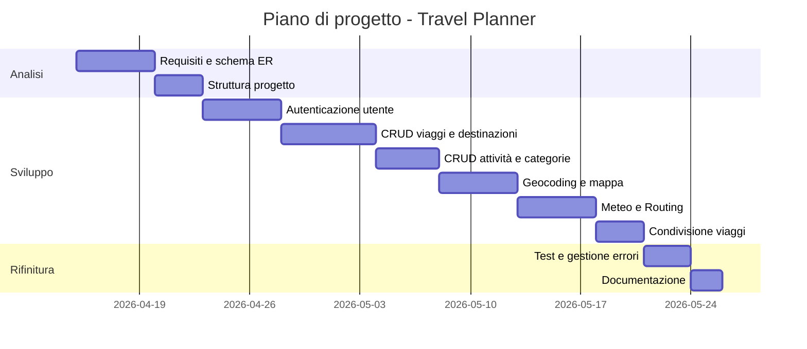

# TravelPlanner-Progetto-Finale

## 1. Introduzione

### 1.1 Scopo del documento

Lo scopo di questo documento è:

- descrivere in modo chiaro il prodotto da realizzare;
- raccogliere i requisiti funzionali e non funzionali;
- fornire una progettazione concettuale con schema ER e casi d'uso;
- definire una roadmap di sviluppo con milestone e attività principali.

### 1.2 Contesto

Il progetto è sviluppato nell'ambito del quinto anno di informatica e prevede la realizzazione di un'applicazione web con backend Python/Flask e database relazionale SQLite3. Il progetto include un sistema di autenticazione, un CRUD completo e l'integrazione con servizi esterni tramite API pubbliche gratuite, senza JavaScript lato client.

### 1.3 Tema scelto

Tema scelto: **Travel Planner**.

Travel Planner è un'applicazione web per la pianificazione e condivisione di viaggi. L'utente può creare e gestire i propri viaggi, aggiungere destinazioni georeferenziate con attività specifiche, consultare le previsioni meteo, calcolare percorsi tra destinazioni e condividere i propri itinerari con altri utenti.

Le API utilizzate sono tutte gratuite e non richiedono registrazione a pagamento:

| API | Funzione | Key richiesta |
|---|---|---|
| Nominatim | Geocoding (nome città → coordinate) | No |
| Leaflet + OSM | Mappa interattiva per visualizzare destinazioni e attività | No |
| Open-Meteo | Previsioni meteo fino a 7 giorni con dati dettagliati | No |
| OSRM | Calcolo percorsi e distanze tra due coordinate | No |

---

## 2. Obiettivi generali

1. Permettere a un utente di registrarsi e autenticarsi in modo sicuro.
2. Consentire la creazione, modifica, eliminazione e visualizzazione dei viaggi (CRUD completo).
3. Permettere di aggiungere destinazioni a un viaggio con coordinate geografiche e date di arrivo/partenza.
4. Permettere la creazione e gestione di attività associate alle destinazioni (hotel, ristoranti, musei, attrazioni, trasporti, etc.).
5. Mostrare le previsioni meteo a 7 giorni per le destinazioni nel periodo del viaggio.
6. Calcolare percorsi e distanze tra destinazioni tramite routing engine.
7. Condividere i propri viaggi con altri utenti e visualizzare i viaggi condivisi altrui.
8. Mantenere tutta la logica lato server con chiamate API server-side.

---

## 3. Stakeholder e attori

| Stakeholder | Ruolo | Interesse |
|---|---|---|
| Studente | Sviluppatore | Realizzare il progetto rispettando i requisiti |
| Docente | Valutatore | Verificare correttezza tecnica e completezza |
| Utente finale | Viaggiatore | Usare l'app per pianificare e gestire i propri viaggi |

### Attori principali

- `Utente autenticato` — può creare e gestire i propri viaggi, aggiungere destinazioni e attività, consultare meteo e calcolare percorsi, e condividere i propri viaggi.
- `Visitatore` — può accedere alle pagine di login e registrazione, visualizzare i viaggi condivisi da altri utenti, e esplorare destinazioni tramite la pagina Esplora.
- `Utente visitatore (non autenticato)` — visualizza viaggi condivisi pubblicamente e ha accesso limitato alla pagina Esplora.

---

## 4. Requisiti funzionali

### 4.1 Requisiti funzionali principali

1. Registrazione con nome, email e password (hashing con `werkzeug.security`).
2. Login con verifica credenziali e gestione della sessione Flask.
3. Logout che cancella la sessione utente.
4. Protezione delle route con decoratore `login_required`.
5. Creazione di un nuovo viaggio con titolo, data inizio, data fine e note personali.
6. Visualizzazione dell'elenco dei propri viaggi.
7. Modifica di un viaggio esistente (titolo, date, note).
8. Eliminazione di un viaggio (con cascata delle destinazioni associate).
9. Ricerca di una destinazione tramite Nominatim (geocoding server-side).
10. Aggiunta di destinazioni a un viaggio con coordinate lat/lng salvate nel DB e date arrivo/partenza.
11. Rimozione di destinazioni da un viaggio.
12. Creazione di attività associate a una destinazione (hotel, ristorante, museo, attrazione, trasporto, generale).
13. Rimozione di attività da una destinazione.
14. Previsioni meteo a 7 giorni per una destinazione tramite Open-Meteo (temperature, precipitazioni, alba/tramonto).
15. Calcolo di percorsi e distanze tra due coordinate tramite OSRM.
16. Visualizzazione interattiva di destinazioni e attività su mappa (Leaflet + OpenStreetMap).
17. Condivisione dei propri viaggi (toggle) visibili ad altri utenti.
18. Visualizzazione dei viaggi condivisi da altri utenti con nome del proprietario.
19. Accesso limitato ai viaggi: proprietario accesso illimitato, visitatori solo se condiviso.

### 4.2 User stories

- Come **visitatore**, voglio registrarmi e accedere affinché i miei viaggi siano salvati e privati sotto il mio account.
- Come **utente autenticato**, voglio creare un viaggio con titolo, date e note per organizzare la mia pianificazione.
- Come **utente autenticato**, voglio cercare una città e aggiungerla come destinazione a un viaggio con date di arrivo e partenza.
- Come **utente autenticato**, voglio aggiungere attività (hotel, ristorante, attrazione) alle mie destinazioni per pianificare le attività specifiche.
- Come **utente**, voglio vedere le previsioni meteo a 7 giorni per una destinazione in modo da preparare i bagagli.
- Come **utente autenticato**, voglio calcolare la distanza e il percorso tra due destinazioni per pianificare il tragitto.
- Come **utente autenticato**, voglio condividere i miei viaggi con altri utenti per far conoscere i miei itinerari.
- Come **visitatore**, voglio visualizzare i viaggi condivisi da altri utenti per trarre ispirazione dai loro piani.
- Come **utente autenticato**, voglio modificare o eliminare un viaggio se cambio i miei piani.
- Come **utente autenticato**, voglio visualizzare le mie destinazioni e attività su una mappa interattiva.

---

## 5. Requisiti non funzionali

- L'applicazione deve essere eseguibile localmente tramite un ambiente virtuale Python.
- Le password devono essere salvate come hash (`werkzeug.security`) e mai in chiaro nel database.
- Le configurazioni sensibili devono essere gestite tramite file `.env`, escluso da git.
- Il codice deve essere organizzato con Blueprint e Repository pattern per separazione dei responsabilità.
- I dati devono essere persistenti tra una sessione e l'altra tramite SQLite3.
- Le chiamate alle API esterne avvengono interamente lato server.
- L'interfaccia deve essere semplice e navigabile, utilizzando CSS personalizzato senza framework CSS esterni.
- Le dipendenze devono essere minime: `flask`, `requests`, `python-dotenv`, `werkzeug`.
- Le mappe devono essere caricate con Leaflet.js e tile OpenStreetMap.
- L'applicazione deve gestire errori HTTP (404, 403, 500) con pagine dedicate.
- L'accesso ai viaggi deve essere controllato: solo proprietario e utenti con viaggio condiviso possono visualizzare.

---

## 6. Casi d'uso

### 6.1 Casi d'uso essenziali

1. Registrazione utente
2. Login
3. Logout
4. Creazione viaggio
5. Modifica viaggio
6. Eliminazione viaggio
7. Ricerca e aggiunta destinazione
8. Rimozione destinazione
9. Aggiunta attività a destinazione
10. Rimozione attività da destinazione
11. Ricerca previsioni meteo
12. Calcolo percorso e distanza
13. Visualizzazione mappa interattiva
14. Condivisione viaggio
15. Visualizzazione viaggi condivisi

### 6.2 Descrizione semplificata dei casi d'uso

- **Registrazione**: il visitatore inserisce nome, email e password; il sistema verifica che l'email non sia già registrata, crea l'account con password hashata e reindirizza al login.
- **Login**: l'utente inserisce email e password; Flask verifica le credenziali e apre una sessione in caso di successo, altrimenti mostra un messaggio di errore.
- **Logout**: l'utente clicca su "Esci"; Flask cancella la sessione e reindirizza al login.
- **Crea viaggio**: l'utente compila un form con titolo, date e note; il sistema salva il viaggio nel database e reindirizza all'elenco.
- **Modifica viaggio**: l'utente modifica i campi di un viaggio esistente; il sistema aggiorna il record nel database.
- **Elimina viaggio**: l'utente conferma l'eliminazione; il sistema cancella il viaggio e tutte le destinazioni e attività associate (cascata).
- **Aggiungi destinazione**: l'utente cerca una città tramite geocoding (step 1: Flask chiama Nominatim); seleziona il risultato (step 2: Flask salva nome, coordinate e date nel DB); la destinazione appare sulla mappa.
- **Aggiungi attività**: l'utente seleziona una destinazione e aggiunge un'attività (nome, tipo, coordinate opzionali); il sistema salva l'attività e la visualizza sulla mappa.
- **Consulta meteo**: l'utente visualizza una destinazione; Flask chiama Open-Meteo e mostra le previsioni a 7 giorni con temperature, precipitazioni, alba e tramonto.
- **Calcola percorso**: l'utente ha due destinazioni; Flask chiama OSRM e restituisce distanza, tempo di viaggio e geometria del percorso.
- **Visualizza mappa**: la mappa interattiva mostra destinazioni come marker, attività come sotto-marker categorizzati con icone, e percorsi calcolati come linee.
- **Condividi viaggio**: l'utente clicca su "Condividi"; il sistema aggiorna il flag `condiviso=1` nel database; il viaggio appare nella lista "Comunità".
- **Visualizza viaggi condivisi**: il visitatore (anche non autenticato) accede alla homepage e vede l'elenco dei viaggi condivisi con il nome del proprietario.

### 6.3 Relazioni tra casi d'uso: include ed extend

Le relazioni `<<include>>` indicano comportamenti sempre necessari; le relazioni `<<extend>>` indicano comportamenti opzionali che si attivano solo in certe condizioni.

| Caso d'uso base | Tipo | Caso d'uso collegato | Descrizione |
|---|---|---|---|
| Creazione viaggio | `<<include>>` | Login | L'utente deve essere autenticato |
| Modifica viaggio | `<<include>>` | Login | L'utente deve essere autenticato |
| Eliminazione viaggio | `<<include>>` | Login | L'utente deve essere autenticato |
| Eliminazione viaggio | `<<extend>>` | Eliminazione destinazioni | Le destinazioni vengono eliminate insieme al viaggio |
| Eliminazione viaggio | `<<extend>>` | Eliminazione attività | Le attività vengono eliminate insieme alle destinazioni |
| Aggiungi destinazione | `<<include>>` | Login | L'utente deve essere autenticato |
| Aggiungi destinazione | `<<include>>` | Geocoding Nominatim | La ricerca richiede sempre la chiamata a Nominatim |
| Aggiungi destinazione | `<<extend>>` | Visualizzazione mappa | La destinazione appare sulla mappa |
| Aggiungi attività | `<<include>>` | Login | L'utente deve essere autenticato |
| Aggiungi attività | `<<extend>>` | Visualizzazione mappa | L'attività appare sulla mappa |
| Consulta meteo | `<<include>>` | Login | L'utente deve essere autenticato |
| Consulta meteo | `<<include>>` | Open-Meteo API | Il meteo richiede sempre una chiamata a Open-Meteo |
| Calcola percorso | `<<include>>` | OSRM API | Il routing richiede sempre una chiamata a OSRM |
| Visualizza mappa | `<<include>>` | Leaflet + OSM | La mappa usa sempre Leaflet e OpenStreetMap |
| Condividi viaggio | `<<include>>` | Login | L'utente deve essere autenticato |
| Visualizza viaggi condivisi | `<<extend>>` | Visualizza dettagli viaggio | L'utente può visualizzare il dettaglio del viaggio condiviso |

### 6.4 Diagramma dei casi d'uso

```
+----------------------------------------------------------+
|                     Travel Planner                       |
|                                                          |
|   [Registrazione]          [Login]   [Logout]            |
|                                                          |
|   [Visualizza viaggi] (pubblica)                         |
|   [Crea viaggio] --------> [Verifica sessione]           |
|   [Modifica viaggio] ----> [Verifica sessione]           |
|   [Elimina viaggio] ------> [Verifica sessione]          |
|         |                                                |
|         +--<<extend>>--> [Elimina destinazioni]          |
|         +--<<extend>>--> [Elimina attività]              |
|                                                          |
|   [Aggiungi destinazione] -> [Verifica sessione]         |
|         |                                                |
|         +--<<include>>-> [Geocoding Nominatim]           |
|         +--<<extend>>--> [Visualizza mappa]              |
|                                                          |
|   [Rimuovi destinazione] -> [Verifica sessione]          |
|                                                          |
|   [Aggiungi attività] -----> [Verifica sessione]         |
|         |                                                |
|         +--<<extend>>--> [Visualizza mappa]              |
|                                                          |
|   [Rimuovi attività] -------> [Verifica sessione]        |
|                                                          |
|   [Consulta meteo] ---------> [Verifica sessione]        |
|         +--<<include>>-> [Open-Meteo API]                |
|                                                          |
|   [Calcola percorso] -------> [Verifica sessione]        |
|         +--<<include>>-> [OSRM API]                      |
|                                                          |
|   [Visualizza mappa] -> [Leaflet + OpenStreetMap]        |
|                                                          |
|   [Condividi viaggio] -------> [Verifica sessione]       |
|                                                          |
|   [Visualizza viaggi condivisi] (pubblica)               |
|                                                          |
+----------------------------------------------------------+
       ^                              ^
       |                              |
  [Visitatore]              [Utente autenticato]
```

---

## 7. Glossario dei termini

| Termine | Definizione |
|---|---|
| Viaggio | Un piano di viaggio creato da un utente, con titolo, date inizio/fine e note personali. Può essere privato o condiviso. |
| Destinazione | Una città o luogo associato a un viaggio, con coordinate lat/lng salvate nel DB e date di arrivo/partenza. |
| Attività | Un'azione o punto di interesse associato a una destinazione (hotel, ristorante, museo, attrazione, trasporto, generale) con coordinate opzionali. |
| Geocoding | Conversione del nome di una città in coordinate geografiche tramite Nominatim API. |
| Routing | Calcolo del percorso e della distanza tra due coordinate tramite OSRM API. |
| Meteo | Previsioni meteorologiche a 7 giorni ottenute da Open-Meteo API con dati di temperatura, precipitazioni, alba/tramonto. |
| Mappa | Visualizzazione interattiva delle destinazioni e attività su una mappa Leaflet con tile OpenStreetMap. |
| Utente | Account registrato che può gestire i propri viaggi privati e condivisi. |
| Visitatore | Utente non autenticato che può visualizzare solo i viaggi pubblici condivisi. |
| Sessione | Stato di autenticazione mantenuto da Flask tra una richiesta e l'altra. |
| Repository | Classe Python che gestisce l'accesso al database per una specifica entità (Utente, Viaggio, Destinazione, Attività). |
| Blueprint | Modulo Flask che raggruppa route correlate (auth, trips, explore, api). |
| Hash | Trasformazione irreversibile della password prima del salvataggio nel database tramite werkzeug.security. |
| `.env` | File di configurazione locale con variabili sensibili, escluso dal repository git. |
| Condiviso | Flag (0/1) che determina se un viaggio è privato (0) o pubblico (1) e visibile ad altri utenti. |
| OSRM | Open Source Routing Machine: servizio gratuito per calcoli di percorsi e distanze. |

---

## 8. Pianificazione e milestone

| Settimana | Attività |
|---|---|
| 1 | Analisi requisiti, schema ER (Utente, Viaggio, Destinazione, Attività), struttura progetto, configurazione ambiente virtuale |
| 2 | Sistema di autenticazione (registrazione, login, logout, sessione, `login_required`), repository pattern |
| 3 | CRUD viaggi e destinazioni, geocoding server-side tramite Nominatim, base mappa Leaflet |
| 4 | CRUD attività con categorie, integrazione Open-Meteo, visualizzazione mappa interattiva |
| 5 | Routing OSRM, condivisione viaggi, visualizzazione viaggi pubblici |
| 6 | Testing, gestione errori (404, 403, 500), pagine dedicate agli errori |
| 7 | Documentazione, ottimizzazioni, push su GitHub |

### 8.1 Gantt semplificato


```mermaid
gantt
    dateFormat  YYYY-MM-DD
    title Piano di progetto - Travel Planner
    section Analisi
    Requisiti e schema ER          :a1, 2026-04-15, 5d
    Struttura progetto             :a2, after a1, 3d
    section Sviluppo
    Autenticazione utente          :b1, after a2, 5d
    CRUD viaggi e destinazioni     :b2, after b1, 6d
    CRUD attività e categorie      :b3, after b2, 4d
    Geocoding e mappa              :b4, after b3, 5d
    Meteo e Routing                :b5, after b4, 5d
    Condivisione viaggi            :b6, after b5, 3d
    section Rifinitura
    Test e gestione errori         :c1, after b6, 3d
    Documentazione                 :c2, after c1, 2d
```